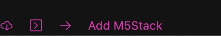

# Smarthome Lichtsteuerung
Dieses Programm wurde mit C/C++ programmiert und beinhaltet einen Telegram Chatbot, welcher mit Python programmiert wurde. 

## Was kann das Programm? 

* Mit Telegram Chatbot Leuchtfunktionen setzen
* Mit Display vom M5Stack Core2 Leuchtfunktionen setzen
* Automatische Helligkeit des Lichts des LED Streifen setzen. 
* Leuchtfunktionen: 
  * Weiss
  * Einzelne Farben
  * Einzelne Farben blinkend
  * Rainbow
  * Party
  * "First Light"
  * Aus

## Was wird benötigt?
* [M5Stack Core2](https://shop.m5stack.com/products/m5stack-core2-esp32-iot-development-kit)
* [M5Go Bottom2](https://shop.m5stack.com/products/m5go-battery-bottom2-for-core2-only)
* [DLight Unit - Ambient Light Sensor](https://shop.m5stack.com/products/dlight-unit-ambient-light-sensor-bh1750fvi-tr)
* [SK6812 Digital RGB LED Strip](https://shop.m5stack.com/products/sk6812-rgb-led-flex-strip)

## Wie benutze ich das Programm?
Das Programm nutzt die PlatformIO Erweiterung in Visual Studio Code. Insgesamt, um das Programm zu starten, müssen folgende Schritte befolgt werden: 
* GitHub Repo clonen
* Repo in IDE öffnen (z.B. [VS Code](https://code.visualstudio.com))
* PlatformIO installieren
* M5Stack Core2 (<u>[mit M5Go Bottom2](https://docs.m5stack.com/en/base/m5go_bottom2)</u>) anschliessen

  

* DLight Sensor Unit (Port A) und LED Streifen (Port C) an den M5Stack Core2 anschliessen
* Option 1: Command Palette öffnen
  * Mac: Shift + Command + P
  * Windows/Linux: Ctrl + Shift + P
  * &rarr; "PlatformIO: Build"
  * &rarr; "PlatformIO: Upload and Monitor"

  

* Option 2: Button
  * Häkchen &#x2713; für "Build"
  * Pfeil &rarr; für "Upload and Monitor"

Nach Befolgung dieser Schritte sollte das Programm auf dem angeschlossenen M5Stack Core2 Gerät laufen. 

## Mögliche Fehler
### Ports
---
Stellen Sie sicher, dass..
* das DLight Sensor Unit am <u>Port A</u> angeschlossen ist.
* der LED Streifen am <u>Port C</u> angeschlossen ist. 

Falls für den LED Streifen ein anderer Port verwendet wird oder die Ports ausgetauscht werden (bitte Gerätbeschreibung genau durchlesen und den Sensor überprüfen), müssen evtl. in der [Main-Datei](./src/main.cpp) die Pins geändert werden.

Auf dem Sensor wird z.T. angezeigt, welcher Port benutzt werden soll. Für das DLight Sensor Unit sollte grundsätzlich Port A verwendet werden.

    

### Konfiguration
---
Die Konfiguration sollte so funktionieren, wie in diesem Repo angegeben. Falls es nicht funktionieren sollte, müssen einzelne Variabeln geändert werden (z.B. env, falls ein anderes Gerät vorhanden ist).   
**Durch Änderungen der Konfiguration können Builds und Uploads des Projekts failen.**

## Links
- [Lux Wert Interpretation](https://learn.microsoft.com/en-us/windows/win32/sensorsapi/understanding-and-interpreting-lux-values)
- [Telegram Chatbot](https://t.me/lightningmcbot)
- [Verwendeter Beispielcode FastLED](https://github.com/FastLED/FastLED/tree/master/examples)
- [Verwendete Grundstruktur des Projekts](https://github.com/alptbz/core2guidemo)